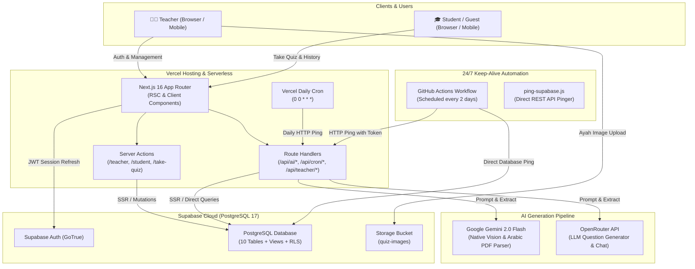
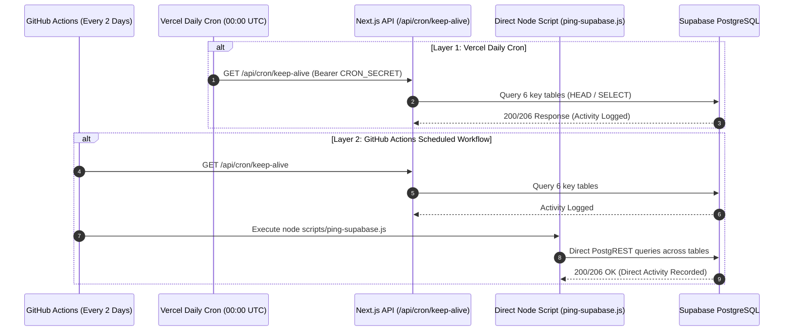
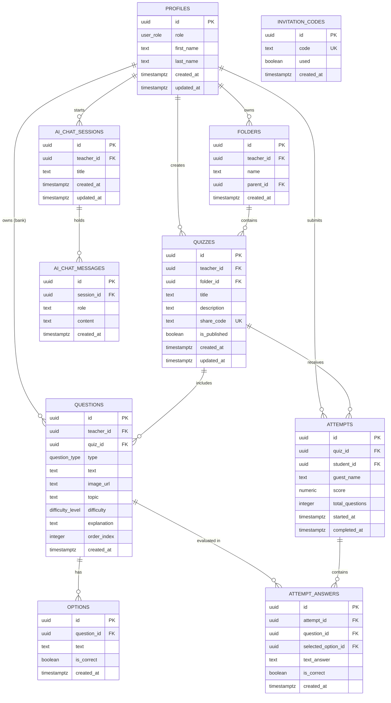
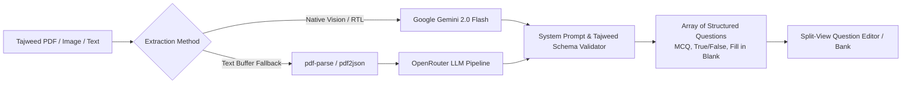

# Tajweed Quiz Platform (Al-Qalam) — System Architecture

This document describes the end-to-end software architecture, data models, AI integrations, security mechanisms, and 24/7 automated keep-alive infrastructure of the **Al-Qalam (القلم) Tajweed Quiz Platform**.

---

## 1. Technology Stack

| Layer | Technology | Purpose / Highlights |
| :--- | :--- | :--- |
| **Frontend Framework** | **[Next.js 16](https://nextjs.org/)** (App Router, Turbopack) | Server Components (RSC), Server Actions, Route Handlers, SSR & streaming. |
| **Language & Tooling** | **TypeScript 5** | Strict type safety across frontend components, database types, and API routes. |
| **Styling & Design System** | **Tailwind CSS v4** + **Radix UI** (shadcn/ui) | Manuscript-inspired Islamic aesthetic (Olive Green `#666600`, Gold, Parchment textures). Full native Right-to-Left (RTL) Arabic typography (`Tajawal`, `Amiri Quran`). |
| **Backend & Database** | **[Supabase](https://supabase.com/)** (PostgreSQL 17) | Relational database, GoTrue Auth (JWT/cookies), Row Level Security (RLS), and S3-compatible Storage (`quiz-images`, `quiz-audio`). |
| **AI Question Engine** | **Google GenAI SDK (`@google/genai`)** & **OpenRouter** | Next-gen unified Google GenAI SDK with Gemini 2.0 Flash schema output, native multimodal vision, and resilient OpenRouter routing. |
| **Multimedia & Quran Audio** | **EveryAyah API & Web Audio API** | Real-time Quranic recitations (Al-Husary, El-Minshawi, Alafasy) and student voice recording with teacher manual grading portal. |
| **Classroom & Printable Exams** | **Halaqat & High-DPI Vector Print Engine** | Class grouping by join code, timed countdown quizzes, printable A4 paper exams with Answer Keys, and Gold Completion Certificates. |
| **Hosting & Deployment** | **[Vercel](https://vercel.com/)** | Edge network, serverless function execution, automatic SSL, and scheduled cron jobs. |
| **Automated Keep-Alive** | **GitHub Actions** + **Vercel Cron** | Scheduled heartbeat runner ensuring 100% free tier uptime without Supabase inactivity pauses. |

---

## 2. High-Level Architecture Diagram

---

## 3. 24/7 Zero-Cost Keep-Alive Subsystem

To overcome Supabase free-tier 7-day inactivity pausing without incurring monthly hosting fees, the application utilizes a **redundant multi-layer automated keep-alive system**:

### Key Components:
1. **GitHub Actions Workflow ([`.github/workflows/keep-alive.yml`](file:///c:/Users/masal/Documents/opencode/tajweed-quiz-app/.github/workflows/keep-alive.yml))**: Scheduled at `0 0 */2 * *` (runs every 48 hours). Executes both HTTP ping and direct database queries using repository secrets.
2. **Direct Ping Script ([`scripts/ping-supabase.js`](file:///c:/Users/masal/Documents/opencode/tajweed-quiz-app/scripts/ping-supabase.js))**: Uses native fetch to send lightweight PostgREST count requests across `quizzes`, `questions`, `profiles`, `folders`, `invitation_codes`, and `ai_chat_sessions`.
3. **Route Handler ([`src/app/api/cron/keep-alive/route.ts`](file:///c:/Users/masal/Documents/opencode/tajweed-quiz-app/src/app/api/cron/keep-alive/route.ts))**: Validates `CRON_SECRET` via header or URL parameter and queries database health.
4. **Vercel Cron ([`vercel.json`](file:///c:/Users/masal/Documents/opencode/tajweed-quiz-app/vercel.json))**: Configured for daily midnight execution (`0 0 * * *`).

---

## 4. Database Entity-Relationship Diagram (ERD)

---

## 5. Security & Access Control Model

### 1. Role-Based Access Control (RBAC)
- **Teacher**: Full access to dashboard (`/teacher`), folder management, quiz creation, AI question generation, question bank, student analytics, and CSV exports.
  - *Teacher Registration Guard*: Requires a single-use administrative invitation code (`invitation_codes` table). Verified securely on the server via `SUPABASE_SERVICE_ROLE_KEY`.
- **Student**: Access to student portal (`/student`), enrolled quizzes, quiz-taking interface (`/take-quiz/[code]`), personal attempt history (`/student/history`), and profile settings (`/student/settings`).
- **Guest**: Can join published quizzes with a 6-character alphanumeric share code (`/take-quiz/[code]`) without creating an account.

### 2. Row Level Security (RLS)
PostgreSQL Row Level Security is strictly enabled across all tables:
- Teachers can only view, edit, and delete their own folders, quizzes, questions, options, and chat sessions.
- Students can only view their own attempts and published quizzes.
- Anonymous / guest users can insert quiz attempts and answers for published quizzes, but cannot read draft quizzes or teacher banks.

### 3. Anti-Cheating Quiz Evaluation
Student answer submissions are processed server-side via Server Actions / Route Handlers. Correct answer flags (`options.is_correct`) are never leaked to the client during active quiz taking; scores and feedback are computed securely after submission.

---

## 6. AI Question Engine Architecture

1. **Multimodal Document Ingestion**: Uploaded Tajweed textbook pages or notes are passed to Google Gemini 2.0 Flash, which accurately parses Right-to-Left Arabic text, diacritics (Harakat), and Tajweed symbols.
2. **AI Chat Assistant (`/teacher/ai`)**: A conversational interface backed by `ai_chat_sessions` and `ai_chat_messages` allowing interactive question refinement.
3. **Direct Saving**: One-click actions to inject AI-generated questions directly into a quiz or the teacher's persistent Question Bank.
